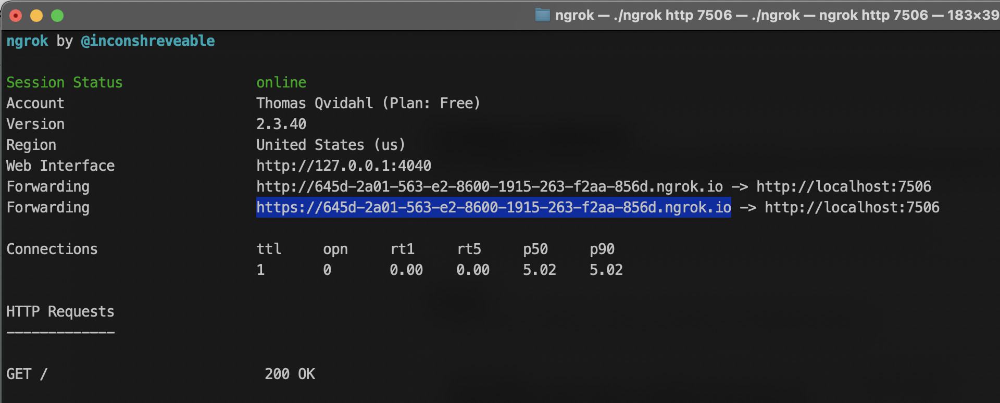
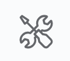
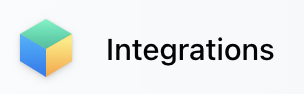

# Iskaribot

Iskaribot is a Facebook Workplace -> Slack message cross-poster, which registers for webhooks and listens for posts to a particular Workplace group. When receiving such a webhook, it will resend the post to a configured Slack-channel (TODO: channels plural) with a link back to the original post and an ingress.

This bot solves the age-old conundrum of how to get developers to read corporate news. 😎

There are three implementations of the same functionality;

- Node.js [/node](node/README.md)
- .NET Core [/dotnet](dotnet/README.md)
- Golang [/go](go/README.md)

Each platform will have the same functionality:

- Respond to incoming HTTP requests. Endpoints:
  - GET request from Workplace with 'random' token to be returned in response. Required by Workplace to validate the endpoint. Only done once, on registering the webook and endpoint.
  - POST request from Workplace with a message posted in a Workplace group.
- Deserialize message from Workplace. Convert from JSON data to in-memory object.
- Fetch any attachments (images, documents) to the message. Workplace uses a Facebook CDN for attachments.
- Formats message for sending to Slack.
- Forwards message to Slack endpoint as a POST HTTP request.

Future/planned functionality:

- Support multiple source Workplace groups.
- Support multiple destination Slack channels/servers.
- Many-to-many relationships between Slack and Workplace groups.
- Support Microsoft Teams as a destination.
- Filter messages by hashtag. For instance only send messages if tagged with `#slack`.
- Frontend admin panel.

## Prerequisites

These are the prerequisites common for each platform version.

First of all you need to clone this repository using git, or by downloading the .ZIP file.

#### 1. Workplace by Facebook

You need an account in a corporate Facebook Workplace tenant, so if you are not the system administrator (likely not) you will need to cosy up to someone who is, and have them help you out with the proper permissions to read data from Workplace and to register the webhook.

#### 1.5 Facebook

The 'personal' Facebook has the same API's as Workplace, so most likely this bot will work just as well there. This has not been the main focus for development, and has not been tested at the time of this writing.

#### 2. Slack

You will need to repeat the process in you Slack tenant; cosy up to the admins, if that's not you, and configure an **Incoming Webhook** so you get a URL to post the content from Workplace to.

## Development

- You will need Git if you want to clone this repository, or you can download the ZIP file.

- You will need a public TLS-enabled endpoint for your localhost process, for this we have used [ngrok](https://ngrok.com/).

### 1. Running Iskaribot locally

Refer to the instructions for your chosen platform:

- Node.js [/node](node/README.md)
- .NET Core [/dotnet](dotnet/README.md)
- Golang [/go](go/README.md)

### 2. Configuring ngrok

To get webhooks from Workplace to hit your local development environment, you need a public TLS-enabled endpoint to forward the webhook for you. Register at [ngrok](https://ngrok.com), follow the instructions there to get your local ngrok client configured.

Run ngrok pointing it to the same TCP port as your local Iskaribot. Default port is 7506. It can look something like this, once running:

### 3. Configuring Facebook Workplace

Using 'Integrations' in Workplace, you can configure a webhook to trigger Iskaribot whenever there is a new post in your WP group.

1. From the left-hand Admin Panel menu: 
1. Choose Integrations: 
1. Click 'Create Custom Integration' and fill in name and description. Suggest name 'Iskaribot' and description pointing to our Github repo. :)
1. On the page for this integration, choose Webhooks 
1. Choose Permissions. Tick 'Read group content'.
1. On th same page, find 'Give integration access to groups', and open 'Group permissions'. Either tick 'All groups', or add your group(s) to 'Specific groups'.
1. On the webhooks page, open 'Groups' and enter the following information:

- Callback URL set to the HTTPS URL of your ngrok client.
- Verify token set to the same value as in your local `.env` file.
- Tick 'posts' to enable the webhook to be 'triggered when a post is added, updated or deleted in a group'.

### Configuring Slack

In Slack, configure a webhook. Add the webhook url to an environment variable ´SLACK_URL´.
This URL will be the endpoint used by Iskaribot to post messages to Slack.

## Deployment

TODO: Dockerfile to build container image for deployment, one for each platform.

## API documentation

### Facebook API

- [Getting Started](https://developers.facebook.com/docs/graph-api/webhooks/getting-started)
- [Permissions](https://developers.facebook.com/docs/workplace/reference/permissions)

### Slack API

- [Incoming webhooks for Slack](https://slack.com/intl/en-no/help/articles/115005265063-Incoming-webhooks-for-Slack)
